# DSQI — DNA Storage Quality Index

> **Version:** v4.3.1c  
> **Project:** Sequence-quality assessment and design support for DNA data storage  
> **Primary implementation:** Python + Apache Spark / MLlib  
> **Notebook:** `DSQI-v4.3.1c-consolidated(RAN).ipynb`

[](https://www.python.org/)
[](https://spark.apache.org/docs/latest/api/python/)
[](#license)

## Overview

**DSQI (DNA Storage Quality Index)** is a sequence-level quality assessment framework designed to estimate how suitable a DNA oligo is for DNA data-storage workflows.

The project combines:

- DNA sequence feature engineering
- Apache Spark RDD and DataFrame processing
- Spark SQL analytics
- Statistical analysis
- Continuous error regression
- Error-risk classification
- Unsupervised clustering
- DNA similarity-graph analysis
- Feature importance and permutation analysis
- A bounded **0–100 DSQI score**
- Cross-platform and external-cohort validation
- Per-sequence explanations
- Retrieval-success modeling
- Storage-feasibility estimation
- An extended **DSQI-13 framework**
- Interactive sequence scoring
- A full sequence-level database explorer
- Reproducibility and artifact export

The central idea is to transform multiple sequence-level quality signals into an interpretable score:

```text
DNA sequence
     │
     ├── GC content
     ├── Homopolymer structure
     ├── Sequence entropy
     ├── k-mer diversity
     └── Length
          │
          ▼
   Component quality scores
          │
          ▼
   Weighting strategy
   ├── Equal weighting
   ├── Statistical weighting
   └── Model-derived weighting
          │
          ▼
       DSQI (0–100)
          │
          ├── Error ranking
          ├── Risk classification
          ├── Explanation
          ├── Feasibility estimation
          └── Sequence recommendation
```

---

## Important: interpretation of the current v4.3.1c run

The supplied execution of v4.3.1c used:

```text
DATA_SOURCE = synthetic_fallback
```

The intended Zenodo dataset was not available at the expected runtime paths. Therefore, the numerical results in the current execution should be interpreted as **method-development and engineering-validation results on synthetic data**, not as final biological evidence.

In particular:

- The primary analytical dataset contains **28,000 rows**.
- EXT2 and EXT3 are also synthetic external cohorts.
- The results demonstrate that the framework behaves consistently under the implemented synthetic data-generating processes.
- They do **not** establish biological generalization to independent experimental datasets.
- A paper-grade run should replace the synthetic source with the intended real dataset and use at least one genuinely independent real dataset for external validation.

---

# System Architecture

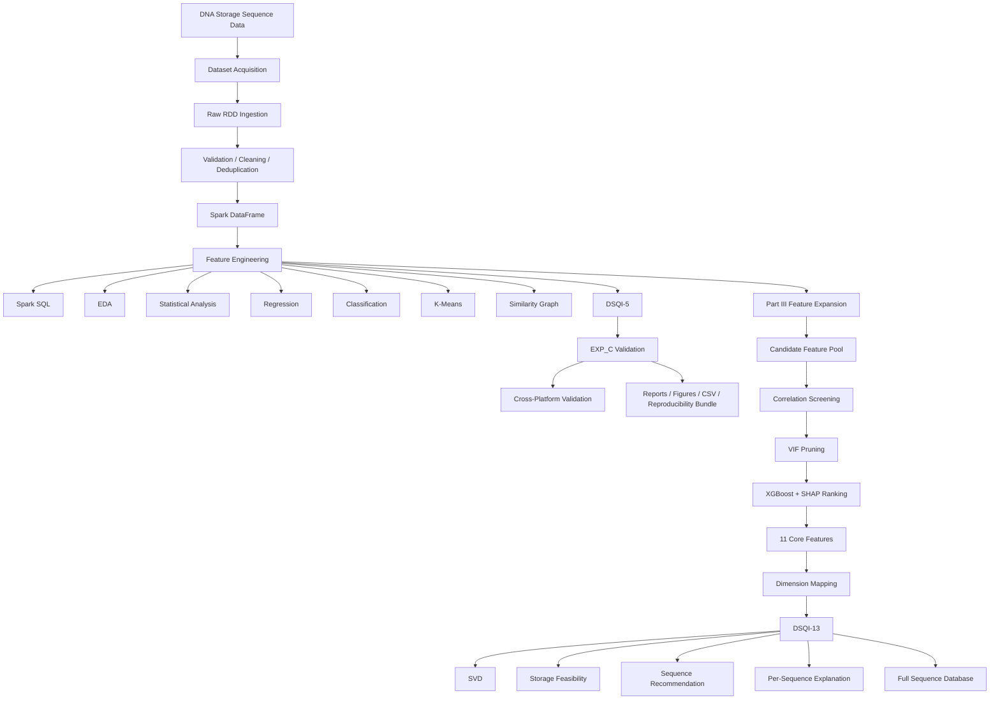

---

# Research Questions

The implementation addresses several related questions.

### RQ1 — What sequence properties are associated with sequencing error?

The framework evaluates features such as:

- GC content
- Homopolymer maximum
- Shannon entropy
- k-mer diversity
- Sequence length

and extends these with a larger candidate feature pool in Part III.

### RQ2 — Can sequence features predict continuous error?

Regression models are trained using Spark MLlib, including:

- Linear Regression
- Random Forest Regression
- Gradient-Boosted Trees

### RQ3 — Can sequences be classified into error-risk categories?

Continuous error is converted into data-derived:

```text
Low
Medium
High
```

risk categories using tercile-based thresholds.

### RQ4 — Can an interpretable quality index summarize the multivariate signal?

The DSQI combines multiple normalized component scores into a bounded:

```text
0 ≤ DSQI ≤ 100
```

where higher values indicate better predicted sequence quality.

### RQ5 — Does DSQI generalize across platforms and altered datasets?

The notebook evaluates:

- EXP_C
- platform-specific subsets
- platform-to-platform transfer
- EXT2
- EXT3

with the important caveat that EXT2/EXT3 are synthetic in the supplied execution.

---

# Dataset Pipeline

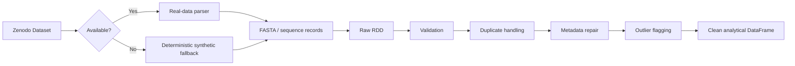

The cleaning stage deliberately records negative results rather than silently discarding problematic observations.

The supplied run reports:

| Cleaning operation | Result |
|---|---:|
| Invalid sequences removed | 120 |
| Duplicates removed | 250 |
| Length-bound removals | 0 |
| Missing platforms repaired | 3 |
| Extreme-error observations flagged | 1,290 |
| Final analytical rows | 28,000 |

---

# Feature Engineering

The core DSQI uses five sequence-level signals.

## 1. GC Content

```text
GC = (G + C) / sequence_length
```

GC content measures the fraction of guanine and cytosine bases.

The framework does **not** assume that "more GC is always better."

Instead, the observed relationship is treated as approximately U-shaped, with quality being best around a development-derived optimum.

---

## 2. Maximum Homopolymer Length

A homopolymer is a consecutive run of the same nucleotide:

```text
AAAA
CCCC
GGGG
TTTT
```

The feature records the longest such run.

Long homopolymers are particularly important in the executed models.

The RF ablation experiment provides strong evidence for this:

```text
Full RF test R²        ≈ 0.764
Without homopolymer    ≈ 0.539
```

This is the largest reported single-feature ablation effect.

---

## 3. Shannon Entropy

For nucleotide probabilities `p(A), p(C), p(G), p(T)`:

```text
H = -Σ p(x) log₂ p(x)
```

For four equally represented nucleotides:

```text
Hmax = log₂(4) = 2 bits
```

Higher entropy generally indicates greater nucleotide diversity.

---

## 4. Unique 3-mer Ratio

The sequence is decomposed into overlapping 3-mers.

The ratio of distinct observed 3-mers to available 3-mer positions provides a simple sequence-complexity measure.

It is useful for detecting repetitive or low-complexity sequences.

---

## 5. Sequence Length

Length is included as a quality component because very short and very long sequences can have different practical behavior in a storage workflow.

The final component is calibrated relative to a development-derived length center/scale.

---

# DSQI-5

The initial DSQI is a weighted composite:

```text
DSQI = 100 × Σ wᵢ Sᵢ
```

where:

- `Sᵢ` = normalized component quality score
- `wᵢ` = component weight
- `Σ wᵢ = 1`

Three weighting schemes are evaluated.

### Equal weighting

```text
w₁ = w₂ = ... = w₅
```

Advantages:

- Simple
- Easy to explain
- No model dependence

### Statistical weighting

Weights are derived from the observed strength of association between each component and error.

### Model-derived weighting

Weights are derived from Random Forest feature importance.

The selected model-derived weights in the supplied run are approximately:

| Component | Weight |
|---|---:|
| GC | 0.1486 |
| Homopolymer | 0.3928 |
| Entropy | 0.4063 |
| k-mer | 0.0359 |
| Length | 0.0163 |

This makes **entropy and homopolymer structure** the dominant components in the current synthetic experiment.

---

# Main Results

## Regression

The continuous error models show strong predictive performance.

| Model | Key result |
|---|---:|
| Mean baseline | RMSE ≈ 0.0506 |
| Random Forest | R² ≈ 0.7637 |
| GBT | R² ≈ 0.7908 |
| 5-fold RF CV | R² ≈ 0.7967 |

The important interpretation is not merely that a nonlinear model scores highly, but that sequence-derived features contain substantial information about the synthetic error-generating process.

---

## Classification

The error distribution is divided into three tercile-based classes.

Approximate cutoffs:

```text
Low      < 0.0313
Medium   0.0313 – 0.0676
High     > 0.0676
```

The Logistic Regression classifier reports:

```text
Accuracy ≈ 0.7613
F1       ≈ 0.7637
```

compared with a majority-class baseline of approximately:

```text
F1 ≈ 0.3458
```

For High-vs-Rest classification:

```text
ROC-AUC ≈ 0.9528
```

---

## Clustering

K-Means is evaluated for:

```text
k = 2 ... 8
```

The selected solution is:

```text
k = 6
Silhouette ≈ 0.4038
```

The clusters are then profiled using observed error.

The highest-error cluster has mean error of approximately:

```text
0.1435
```

while the lowest-error clusters are around:

```text
0.040
```

This indicates that unlabeled sequence-profile structure is associated with different error regimes.

---

## Similarity Graph

A sequence similarity graph is constructed using k-mer representations and Jaccard-based nearest-neighbor relationships.

Supplied-run summary:

```text
Nodes        = 846
Edges        = 2,390
Density      ≈ 0.0067
Components   = 1
Communities  = 12
```

Community-level error distributions differ significantly:

```text
Kruskal-Wallis p ≈ 7.42 × 10⁻⁹
```

NetworkX is used for the sampled graph. The notebook documents GraphFrames as a more Spark-native alternative.

---

# DSQI Validation

The primary weighting scheme selected in the supplied run is:

```text
model_derived
```

On the held-out EXP_C batch:

```text
Spearman ρ = -0.7753
95% CI     = [-0.7845, -0.7659]
```

The negative sign is expected:

```text
Higher DSQI
     ↓
Lower sequencing error
```

The three schemes compare approximately as:

| Weighting | EXP_C Spearman |
|---|---:|
| Equal | -0.6182 |
| Statistical | -0.7182 |
| Model-derived | **-0.7753** |

Five-fold development stability also favors model-derived weighting:

```text
Mean ρ ≈ -0.7745
SD     ≈ 0.0060
```

---

# DSQI Risk Bands

The final DSQI can be interpreted as a ranking rather than a direct error percentage.

The supplied EXP_C group means are approximately:

| DSQI group | Mean error |
|---|---:|
| Low | 0.1089 |
| Medium | 0.0559 |
| High | 0.0267 |

Therefore:

```text
Low DSQI
   │
   ├── higher observed error
   │
Medium DSQI
   │
   ├── intermediate error
   │
High DSQI
   │
   └── lower observed error
```

---

# Cross-Platform Validation

Platform-specific EXP_C correlations remain strongly negative:

| Platform | Spearman ρ |
|---|---:|
| Illumina | ≈ -0.863 |
| Nanopore | ≈ -0.859 |
| PacBio | ≈ -0.856 |

The transfer matrix also remains strongly negative across the evaluated known-platform combinations.

These results indicate stable ranking behavior **within the implemented synthetic experiment**.

They should not be interpreted as definitive biological evidence of cross-platform generalization.

---


---

# Visual Results Gallery

The repository contains the **actual generated output figures** from the supplied v4.3.1c run. The figures below are linked directly to the files in `outputs/figures/`, so they render on GitHub when the repository keeps the supplied project structure.

## 1. Overall DSQI Dashboard

<p align="center">
  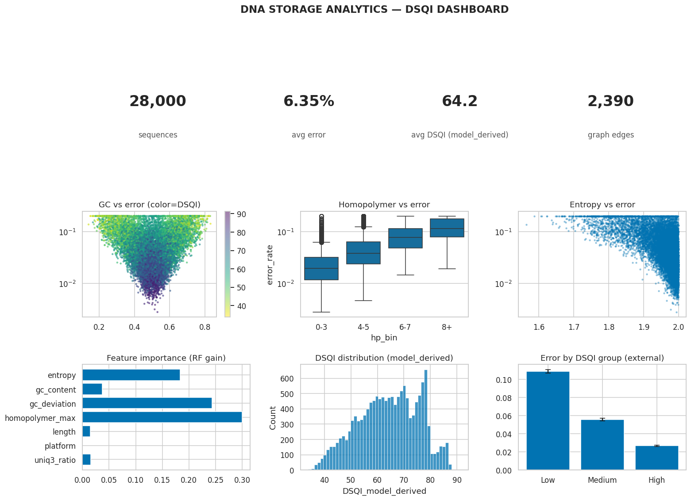
</p>

**`dashboard.png`** — consolidated view of the run, including dataset size, DSQI/error summaries, graph statistics, and major validation indicators.

---

## 2. Exploratory Data Analysis

<p align="center">
  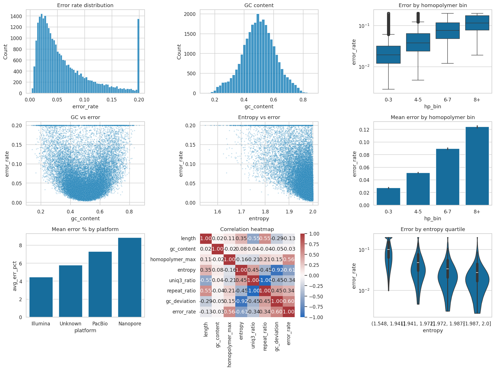
</p>

**`eda_overview.png`** — multi-panel exploration of the sequence-quality feature space, including distributions and relationships among GC content, homopolymers, entropy, length, k-mer diversity, and error.

---

## 3. Model Feature Importance

<p align="center">
  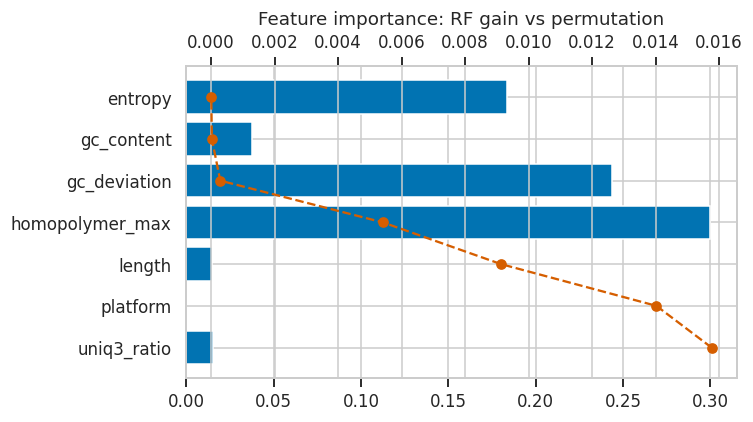
</p>

**`feature_importance.png`** — compares model-derived feature importance with permutation-based importance. Homopolymer structure and GC deviation are among the dominant predictors in the supplied run.

---

## 4. Learning Curve and Feature Ablation

<p align="center">
  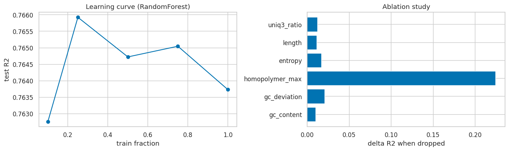
</p>

**`learning_curve_ablation.png`** — shows model performance as training data increases and the effect of removing individual features. The supplied run indicates a particularly large performance impact when the homopolymer feature is removed.

---

## 5. DSQI Validation

<p align="center">
  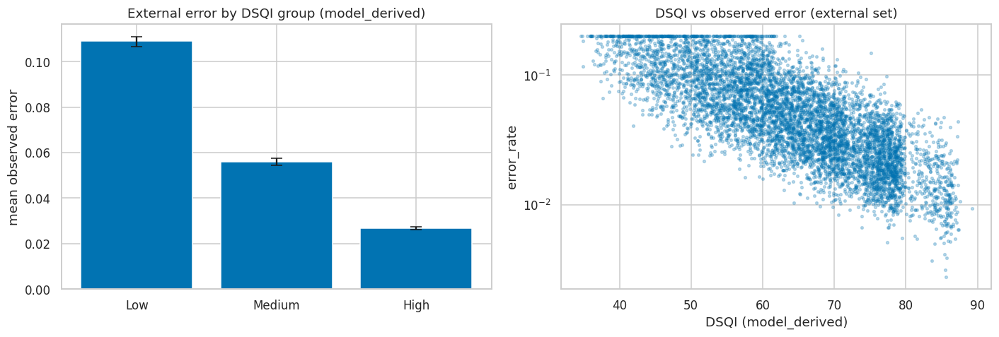
</p>

**`dsqi_validation.png`** — validates the relationship between the DSQI score and observed error. The three DSQI groups show progressively lower mean error from Low → Medium → High.

**Observed group means in the supplied run:**

| DSQI group | Mean observed error |
|---|---:|
| Low | 0.10892 |
| Medium | 0.05591 |
| High | 0.02667 |

The model-derived DSQI had Spearman correlation **−0.7753** with observed error on the external EXP_C cohort.

---

## 6. Cross-Platform Transfer

<p align="center">
  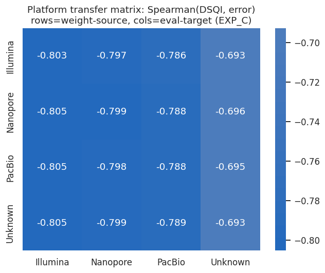
</p>

**`transfer_matrix.png`** — evaluates whether the DSQI/error relationship remains consistent when moving between sequencing platforms such as Illumina, Nanopore, and PacBio.

---

## 7. External Validation

<p align="center">
  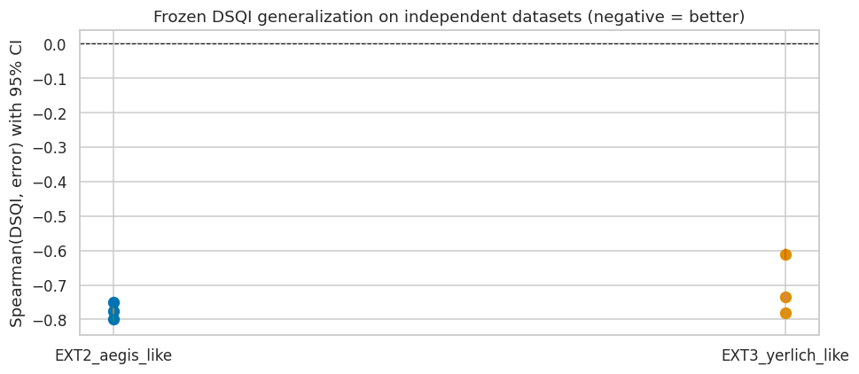
</p>

**`external_validation.png`** — evaluates the DSQI relationship on the additional external cohorts included in the supplied experiment.

For the supplied synthetic external cohorts, the model-derived DSQI correlations were approximately:

- EXT2: **−0.7979**
- EXT3: **−0.7808**

These values demonstrate consistency within the synthetic validation framework; they should not be interpreted as independent biological validation.

---

## 8. Constrained-Code Benchmark

<p align="center">
  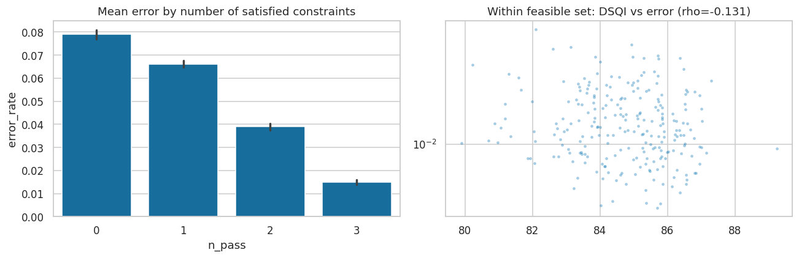
</p>

**`constrained_benchmark.png`** — examines sequence error as storage constraints are satisfied and compares DSQI against observed error. This experiment is especially important for testing whether DSQI adds information beyond simple constraint feasibility.

In the supplied run, DSQI showed a strong overall relationship with error, while the within-constraint-feasible subset produced only a weak additional correlation (**ρ ≈ −0.1312, p ≈ 0.0423**).

---

## 9. Retrieval Performance

<p align="center">
  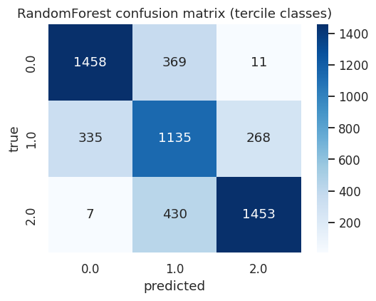
</p>

**`confusion_matrix.png`** — confusion matrix for the supplied Random Forest error-risk classification experiment.

The broader retrieval experiment reported:

| Retrieval model | ROC-AUC | PR-AUC |
|---|---:|---:|
| Logistic Regression / full features | 0.9528 | 0.9753 |
| Random Forest / full features | 0.9468 | 0.9719 |
| DSQI alone | 0.8925 | — |

The figure itself shows the class-level prediction behavior rather than the ROC/PR curves.

---

## 10. Clustering Analysis

<p align="center">
  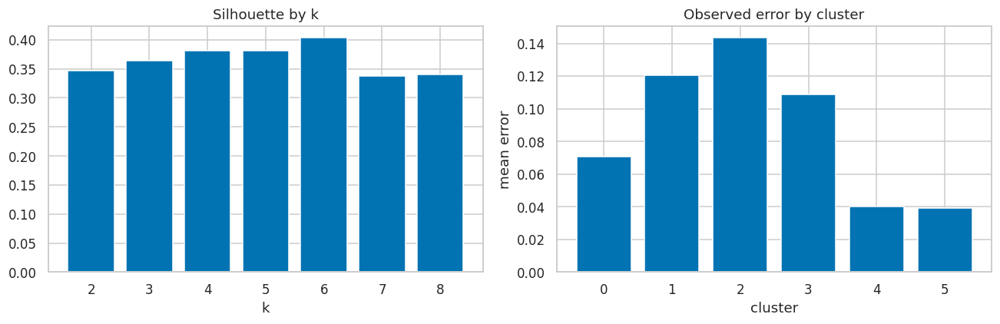
</p>

**`clustering.png`** — K-Means model selection and cluster-level error behavior. The supplied run selected **k = 6** as the best clustering configuration according to silhouette analysis.

---

## 11. Sequence Similarity Graph

<p align="center">
  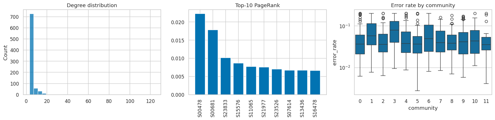
</p>

**`graph_analysis.png`** — graph-based analysis of sequence similarity, including degree distribution, influential nodes, and community-level error behavior.

The supplied graph sample contained **846 nodes**, **2,390 edges**, and **12 detected communities**. High-error sequences showed statistically significant community structure in the supplied experiment.

---

## 12. Explainability — Global SHAP View

<p align="center">
  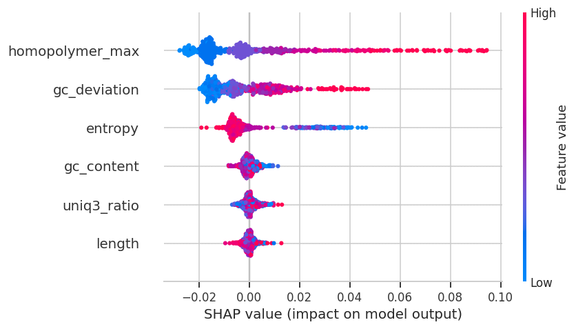
</p>

**`shap_summary.png`** — global explainability view showing how important features influence model predictions across the sequence population.

---

## 13. Explainability — Worst Sequence

<p align="center">
  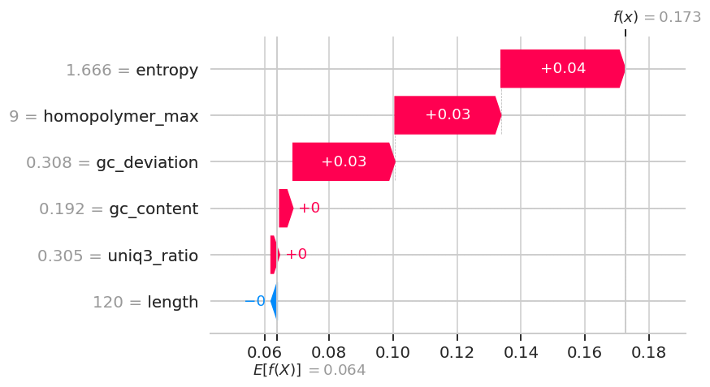
</p>

**`shap_waterfall_worst.png`** — local explanation for a high-error sequence, showing which feature values push the predicted error upward or downward.

---

## 14. Sequence-Level Explanation

<p align="center">
  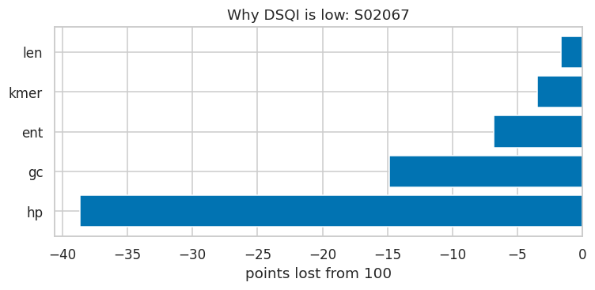
</p>

**`explain_worst.png`** — complementary sequence-level explanation of the worst-performing example and the contribution of its major DSQI-5 components.

---

## 15. Sensitivity / Robustness Analysis

<p align="center">
  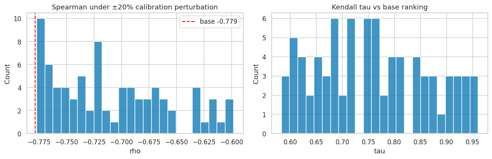
</p>

**`sensitivity.png`** — evaluates how DSQI ranking behaves under perturbations of the calibration conditions.

The supplied experiment used **80 sensitivity trials** and reported:

- Base Spearman ρ: **−0.7786**
- Mean Spearman ρ: **−0.7092**
- Spearman standard deviation: **0.0521**
- Mean Kendall τ: **0.7588**
- Minimum Kendall τ: **0.583**

---

## 16. ECC Overhead Estimate

<p align="center">
  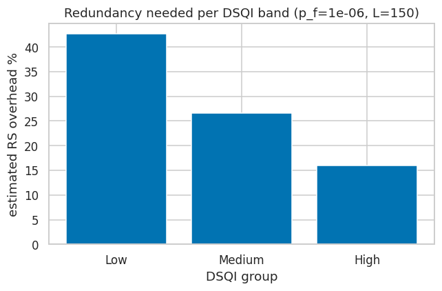
</p>

**`ecc_overhead.png`** — heuristic mapping from DSQI/error groups to Reed–Solomon-style error-correction overhead.

The supplied run estimated:

| DSQI group | Mean error | Estimated ECC overhead |
|---|---:|---:|
| Low | 0.10892 | 42.67% |
| Medium | 0.05591 | 26.67% |
| High | 0.02667 | 16.00% |

**Important:** these ECC values are heuristic estimates, not experimentally demonstrated synthesis/sequencing correction rates.

---

## Figure-to-Research Map

| Figure | Main research purpose |
|---|---|
| `dashboard.png` | Overall system/run summary |
| `eda_overview.png` | Feature-space and data exploration |
| `feature_importance.png` | Predictor importance |
| `learning_curve_ablation.png` | Data scaling and feature contribution |
| `dsqi_validation.png` | DSQI ↔ observed error validation |
| `transfer_matrix.png` | Cross-platform robustness |
| `external_validation.png` | External-cohort validation |
| `constrained_benchmark.png` | Added value beyond constraints |
| `confusion_matrix.png` | Error-risk classification |
| `clustering.png` | Unsupervised sequence structure |
| `graph_analysis.png` | Similarity/community structure |
| `shap_summary.png` | Global explainability |
| `shap_waterfall_worst.png` | Local model explanation |
| `explain_worst.png` | Sequence-level diagnostic explanation |
| `sensitivity.png` | Robustness of DSQI ranking |
| `ecc_overhead.png` | Storage/error-correction implications |


# Part III — Extended Feature Framework

Part III expands the feature space substantially.

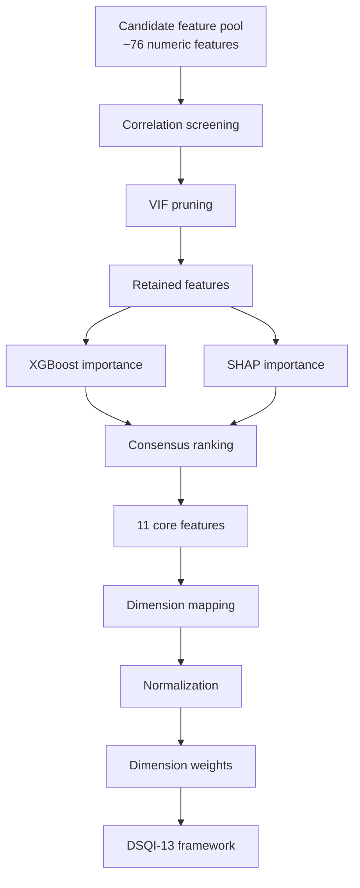

The pipeline uses:

1. Correlation screening
2. Variance Inflation Factor analysis
3. XGBoost gain
4. SHAP mean absolute contribution
5. Consensus ranking

The selected core feature set contains **11 features**.

### Important terminology caveat

The framework is called **DSQI-13**, but in the supplied execution the selected features populate only five active dimensions:

```text
HR
KD
MRR
SCR
SSR
```

The other named parameter groups do not receive selected core features in the executed dimension map.

This should be clarified before using "13-dimensional DSQI" as a formal scientific claim.

---

# Storage Feasibility

The framework additionally estimates whether a sequence satisfies a storage-oriented feasibility criterion.

A held-out feasibility model reports approximately:

```text
ROC-AUC ≈ 0.936
```

This is preferable to the earlier training-evaluated estimate because the v4.3c implementation calibrates thresholds using a held-out split.

However, the feasibility target is derived from the implemented error/recovery assumptions.

It is **not** equivalent to experimentally measured DNA retrieval probability.

---

# Retrieval-Success Modeling

The notebook also asks whether DSQI can compress enough information to predict a binary retrieval-success target.

Results:

| Model | ROC-AUC | PR-AUC |
|---|---:|---:|
| Full-feature Logistic Regression | 0.9528 | 0.9753 |
| Full-feature Random Forest | 0.9468 | 0.9719 |
| DSQI alone | 0.8925 | — |

Interpretation:

```text
Full feature vector
        │
        └── retains the most information

DSQI
        │
        └── compresses the information
            into an interpretable scalar
```

Therefore DSQI is useful as a compact ranking signal, but it does not preserve every bit of predictive information contained in the full feature vector.

---

# Constrained-Code Benchmark

The notebook compares continuous DSQI with conventional hard constraints.

Example hard constraints include:

```text
GC = 45–55%
Maximum homopolymer ≤ 3
Forbidden motif filtering
```

Overall:

```text
DSQI Spearman ρ ≈ -0.7714
Hard-filter pass/fail ρ ≈ -0.1513
```

This supports the idea that a continuous score contains substantially more ranking information than a binary pass/fail screen.

However, among only the 240 sequences passing the hard constraints:

```text
ρ ≈ -0.1312
p ≈ 0.0423
```

The notebook conservatively records this hypothesis as:

```text
NOT SUPPORTED
```

because the effect is weak and the passing subset is small.

---

# Per-Sequence Explainability

The system can decompose an individual DSQI into component contributions.

For example, the worst demonstrated sequence:

```text
Sequence: S02067
DSQI:     34.6
```

has its largest quality loss from:

```text
Homopolymer     ≈ -38.7 points
GC              ≈ -14.9 points
Entropy         ≈  -6.8 points
k-mer           ≈  -3.4 points
Length          ≈  -1.6 points
```

This is important because the DSQI is not intended to be an opaque number.

A sequence designer can see **why** a sequence receives a poor score.

---

# SHAP Explainability

SHAP is implemented through a sklearn Random Forest mirror because native Spark MLlib models do not directly provide the same SHAP workflow.

Top mirror-model features include:

```text
homopolymer_max
gc_deviation
entropy
gc_content
uniq3_ratio
```

### Critical limitation

The notebook performs a mirror-fidelity test:

```text
Spark RF R²       ≈ 0.764
sklearn mirror R² ≈ 0.562
```

Therefore:

> The SHAP figures should not be presented as exact explanations of the deployed Spark Random Forest.

They explain a related sklearn model.

For publication-grade deployed-model explainability, the exact deployed model should be made directly explainable or replaced with a model/explanation strategy that guarantees fidelity.

---

# Sensitivity Analysis

The DSQI calibration parameters are perturbed to test ranking stability.

Reported results:

```text
Trials              = 80
Base Spearman       ≈ -0.7786
Mean perturbed ρ    ≈ -0.7092
SD                  ≈ 0.0521
Minimum Kendall τ   ≈ 0.583
Mean Kendall τ      ≈ 0.759
```

Interpretation:

- The DSQI/error relationship remains directionally stable.
- Absolute performance is sensitive to calibration choices.
- The index is robust enough to retain ranking structure but is not calibration-invariant.

---

# ECC Overhead — Engineering Heuristic

The notebook maps DSQI groups to an estimated error-correction overhead.

Reported estimates:

| DSQI group | Estimated ECC overhead |
|---|---:|
| Low | 42.67% |
| Medium | 26.67% |
| High | 16.00% |

The implemented calculation uses a heuristic based on estimated error probability and target failure probability.

These values are **engineering estimates**, not measured Reed–Solomon/BCH/LDPC decoder results.

A future experimental version should implement an actual encoder/decoder simulation before using these numbers as quantitative coding-overhead claims.

---

# Reproducibility

The project records environment and experiment metadata including:

```text
Python
PySpark
Java
NumPy
Pandas
Random seed
Data source
Calibration parameters
DSQI weights
Graph statistics
Artifact paths
```

The supplied runtime uses:

```text
Python  3.13.15
PySpark 3.5.1
Java    21.0.12
Seed    42
Spark   local[*]
```

The notebook also generates:

```text
CSV result tables
PNG figures
Parquet datasets
Experiment configuration
Environment information
Checksums / manifests
Markdown reports
```

---

# Interactive Components

The notebook contains several user-facing utilities.

## Single-sequence predictor

A DNA sequence can be entered and scored through the interactive predictor.

The output includes:

```text
Sequence
Length
GC content
Homopolymer maximum
Entropy
k-mer diversity
Predicted error
DSQI
Feasibility probability
Recommendation
```

## Full Sequence Database Explorer

The final database contains:

```text
28,000 sequences
22 columns
```

and exposes sequence-level information required to audit the DSQI recommendation.

The database is exported in Parquet format.

---

# Project Structure

A recommended repository layout is:

```text
.
├── README.md
├── DSQI-v4.3.1c-consolidated(RAN).ipynb
│
├── dsqi/
│   ├── __init__.py
│   └── ...
│
├── data/
│   └── README.md
│
├── results/
│   ├── regression_results.csv
│   ├── classification_results.csv
│   ├── dsqi_validation.csv
│   ├── external_datasets_validation.csv
│   └── ...
│
├── figures/
│   ├── eda_overview.png
│   ├── learning_curve_ablation.png
│   ├── clustering.png
│   ├── feature_importance.png
│   ├── dsqi_validation.png
│   ├── external_validation.png
│   ├── graph_analysis.png
│   ├── dashboard.png
│   └── ...
│
├── docs/
│   └── DSQI-v4.3.1c_complete_documentation.md
│
└── requirements.txt
```

Large biological datasets should generally **not** be committed directly to Git. Store dataset metadata, checksums and acquisition instructions instead.

---

# Running the Notebook

## Requirements

The main runtime uses:

- Python 3.13
- PySpark 3.5.1
- Java 21
- NumPy
- Pandas
- scikit-learn
- SciPy
- Matplotlib
- Seaborn
- NetworkX
- RapidFuzz

Additional extensions use packages such as:

- XGBoost
- SHAP
- Plotly
- ipywidgets
- pytest
- MLflow
- ViennaRNA

Not every optional dependency is required for every part of the notebook.

---

## Recommended execution order

The notebook is designed as a sequential pipeline:

```text
Environment
    ↓
Dataset acquisition
    ↓
RDD processing
    ↓
Data cleaning
    ↓
Feature engineering
    ↓
SQL / EDA / statistics
    ↓
Regression / classification / clustering
    ↓
DSQI-5
    ↓
Validation
    ↓
Part III feature expansion
    ↓
DSQI-13
    ↓
Feasibility / recommendation
    ↓
Explainability
    ↓
Interactive tools
    ↓
Export / audit / report
```

For a final research run, execute the complete notebook from a clean runtime rather than relying on previously cached notebook state.

---

# Why Apache Spark?

Spark is used for two reasons.

### Research/engineering reason

Sequence datasets can become large, making distributed transformations useful for:

- ingestion
- feature extraction
- aggregation
- SQL analysis
- ML pipelines

### Project requirement

The notebook explicitly demonstrates Spark concepts including:

```text
RDD
map
filter
flatMap
reduceByKey
groupByKey
distinct
DataFrame
Spark SQL
MLlib
Structured Streaming
```

For the supplied run, Spark is configured as:

```text
local[*]
```

This means the notebook demonstrates the Spark execution model but does **not** constitute a multi-node performance benchmark.

---

# Alternatives Considered

| Component | Current approach | Possible alternative | Why current approach |
|---|---|---|---|
| Distributed processing | PySpark | Dask / Ray | Spark is central to the project architecture |
| Raw sequence processing | RDD | DataFrame / BioPython | RDD demonstrates required low-level Spark operations |
| Regression | RF / GBT | Neural networks | Tree models are more interpretable and lighter |
| Classification | LR / DT / RF | XGBoost / neural classifier | Multiple transparent baselines are useful |
| Clustering | KMeans | DBSCAN / GMM / HDBSCAN | Simple, scalable and available in MLlib |
| Similarity graph | NetworkX | GraphFrames / GraphX | NetworkX is practical for the sampled graph |
| Explainability | SHAP mirror | Exact model-native explainer | Native Spark compatibility is limited |
| Feature selection | Correlation + VIF + XGBoost + SHAP | AutoML / deep embeddings | Current method is interpretable |
| DSQI weighting | Equal/statistical/model-derived | Learned neural scorer | Explicit weights are easier to audit |
| External validation | EXT2/EXT3 | Real independent datasets | Synthetic cohorts keep the pipeline executable offline |
| ECC mapping | Heuristic | Real codec simulation | Current notebook does not implement full decoding |

---

# Current Limitations

The following limitations are important for anyone extending or publishing this project.

## 1. Synthetic primary data

The supplied execution used `synthetic_fallback`.

This is the most important limitation.

## 2. Synthetic external validation

EXT2 and EXT3 are altered synthetic cohorts.

They should not be described as independent experimental datasets.

## 3. Local Spark execution

`local[*]` is not equivalent to a production Spark cluster.

## 4. Predictor threshold inconsistency

`recommend()` uses calibrated `THRESH_CONFIG`, while the later detailed scoring function contains hardcoded feasibility thresholds.

These paths should be unified.

## 5. Placeholder predicted error

One demonstration adapter displays:

```text
Pred error = 2.00%
```

as a placeholder.

That value should not be interpreted as an actual model prediction.

## 6. DSQI-13 dimensional coverage

The framework is named DSQI-13, but only five named dimensions are populated by the selected core features in the current run.

## 7. SHAP mirror fidelity

The sklearn mirror does not reproduce the Spark RF sufficiently closely to support exact deployed-model attribution.

## 8. ECC is heuristic

The ECC overhead numbers are not the result of an actual codec simulation.

## 9. MLflow was not executed

The MLflow extension was skipped because the package was not installed in the supplied runtime.

## 10. Runtime benchmarking is incomplete

The v4.3c timing infrastructure exists, but the notebook does not comprehensively populate stage timings for all heavy operations.

---

# Paper-Grade Checklist

Before treating the project as final experimental evidence:

- [ ] Run the intended real Zenodo dataset.
- [ ] Verify the dataset checksum.
- [ ] Run the full-scale real dataset.
- [ ] Add a genuinely independent real validation dataset.
- [ ] Perform real cross-platform validation.
- [ ] Unify `THRESH_CONFIG` with the interactive predictor.
- [ ] Remove the 2% predicted-error placeholder.
- [ ] Resolve the DSQI-13 dimensional terminology.
- [ ] Improve or replace the SHAP mirror.
- [ ] Run MLflow if experiment tracking is claimed.
- [ ] Instrument all heavy stages for runtime measurements.
- [ ] Verify every expected artifact exists before creating the release bundle.
- [ ] Replace the ECC heuristic with a real coding/decoding experiment.
- [ ] Preserve the negative within-constraint hypothesis result.
- [ ] Report synthetic versus real evidence explicitly in the paper.

---

# Reproducibility and Scientific Scope

The project deliberately separates:

```text
Development
    ↓
Calibration
    ↓
Parameter freezing
    ↓
Held-out validation
    ↓
External stress testing
```

This separation is important because DSQI calibration parameters must not be estimated from the final validation set.

The strongest claim currently supported is:

> **Under the implemented synthetic data-generating processes, sequence-derived quality features can predict error, and a model-derived DSQI provides a strong monotonic ranking of sequence quality on held-out and altered synthetic cohorts.**

The current run does **not** support the stronger claim that DSQI has already been biologically validated across independent experimental studies.

---

# Citation

If this repository is used in a paper, thesis, or presentation, cite the project according to the repository's final publication metadata.

Until a formal citation is assigned, include:

```text
DSQI — DNA Storage Quality Index
Version 4.3.1c
```

---

# License

License information should be added here before public release.

Do not add a license that conflicts with the licenses of third-party datasets, libraries, models, or code incorporated into the project.

---

# Documentation

For the complete technical documentation, including:

- cell-by-cell explanations
- exact notebook source
- architecture diagrams
- detailed result tables
- figure-by-figure interpretation
- statistical methodology
- model analysis
- DSQI construction
- Part III feature selection
- limitations
- reviewer/viva questions

see:

```text
docs/DSQI-v4.3.1c_complete_documentation.md
```

---

## Status

```text
Version:       v4.3.1c
Pipeline:      Implemented
Core DSQI:     Implemented
DSQI-13:       Implemented with active-dimension caveat
Validation:    Implemented
Interactive UI: Implemented
Unit tests:    6 passed
MLflow:        Not executed in supplied run
Primary data:  Synthetic fallback in supplied run
```

**Current status: research prototype / development release.**

A real-data rerun and independent experimental validation are required before treating the reported results as final biological evidence.
